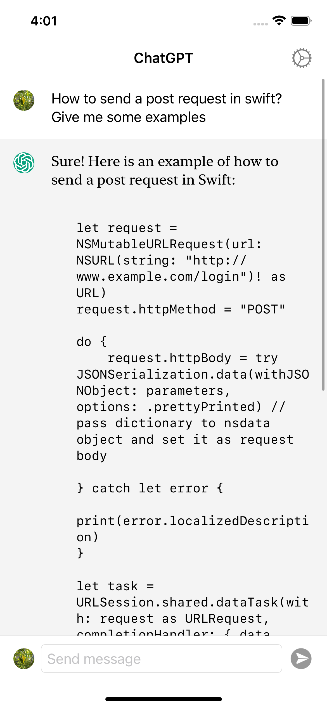
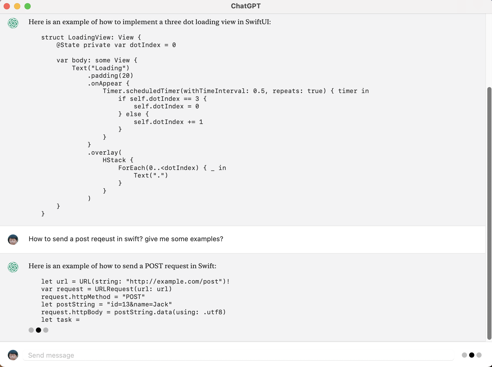
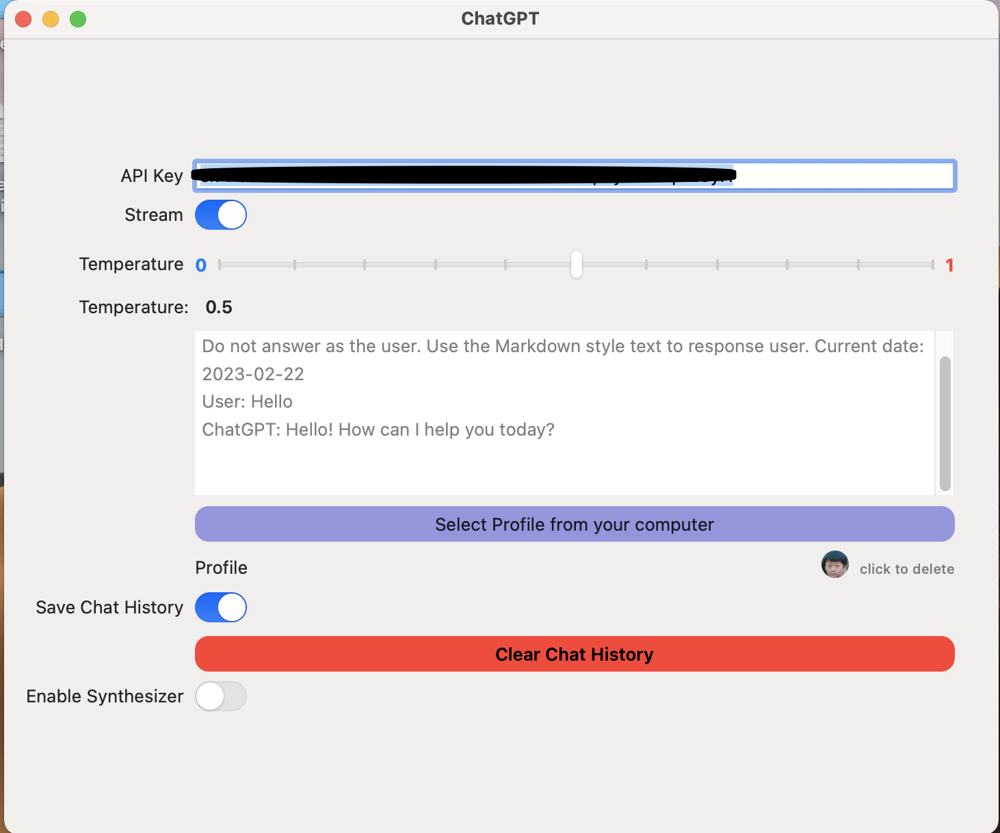

# ChatGPT
A macOS menu bar App and iOS App to communicate with ChatGPT.

## Required

iOS 15.0

macOS 12.0

## Run

### Run on Mac

- Open the `ChatGPT.xcodeproj` and select `ChatGPT (macOS)` target, click `Run`. 
- Right click the menu bar app and click the `Preference` window, past your own `API Key`.

### Run on iPhone Simulator

- Open the `ChatGPT.xcodeproj` and select `ChatGPT (iOS)` target, click `Run`.
- Click the right navigation bar button, past your own `API Key`.

## Screenshots

## Reference

Inspired by the following projects.

[ChatGPTSwiftUI](https://github.com/alfianlosari/ChatGPTSwiftUI)

[OpenAISwift](https://github.com/adamrushy/OpenAISwift)

[swift-markdown-ui](https://github.com/gonzalezreal/swift-markdown-ui)
